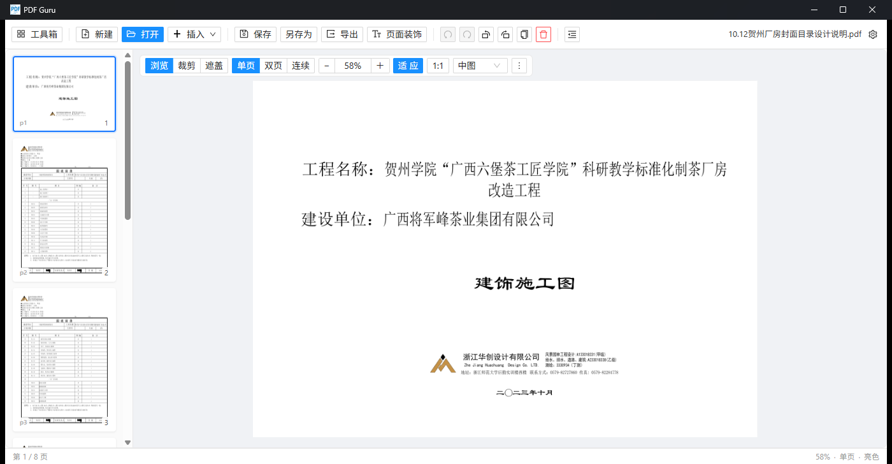
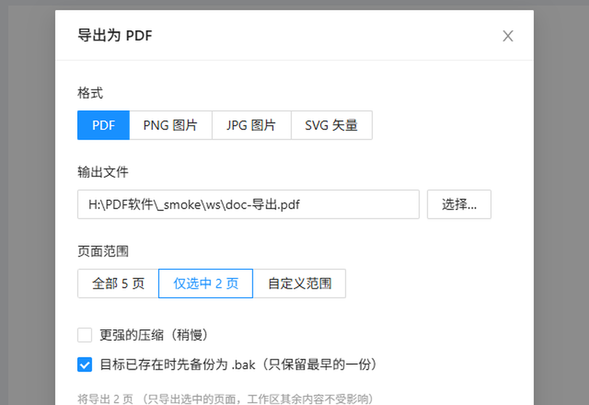
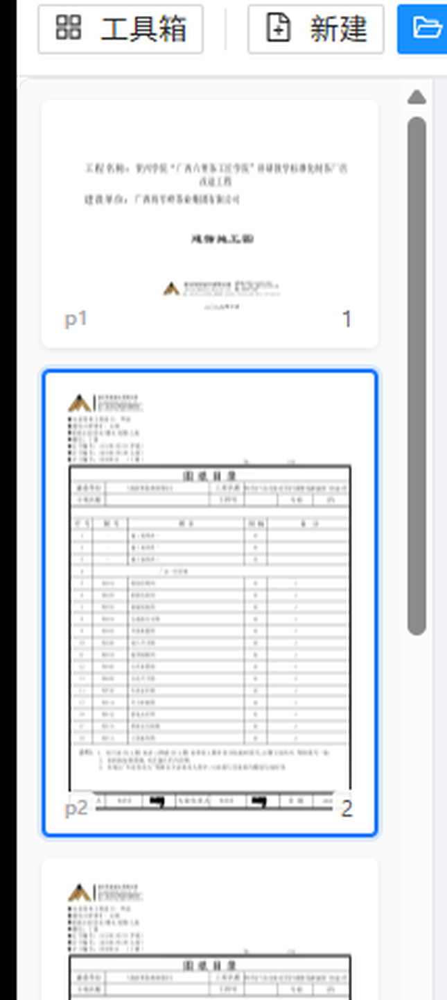
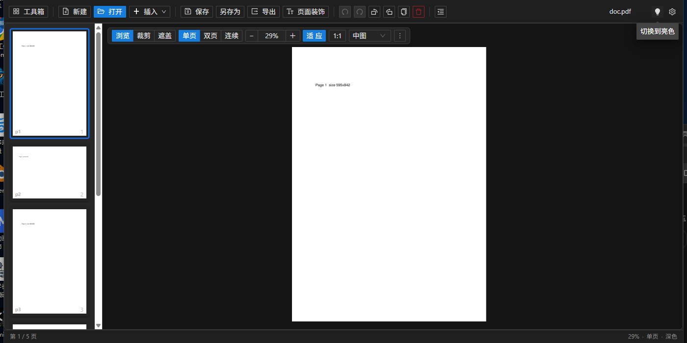

# PDF Guru · 工作区版

> Fork 自 [kevin2li/PDF-Guru](https://github.com/kevin2li/PDF-Guru)，把原本"一堆独立小工具"的界面
> **重做成一个以文档为中心的工作区**：像 PPT 一样管理页面，所有编辑先在内存模型里完成，
> 只有保存/导出才写文件。

[](https://github.com/huangzhenwei2020/PDF-Guru/releases)
[](./LICENSE)
[](#下载)



---

## 这个 fork 做了什么

上游是一个 **PDF 小工具集合**（每个功能一个独立页面：选文件 → 设参数 → 输出）。
这个 fork 换了个思路：**先把文档打开成一个工作区，所有操作都作用在这份文档上**，
改完再一次性保存或导出。

核心差别是**非破坏式**：裁剪、遮盖、旋转、删页、调序都只改内存里的页面模型，
不动源文件；撤销/重做因此是天然的，也不必每改一步就写一次盘。

### 工作区能力

| | |
|---|---|
| **像 PPT 一样管页面** | 左侧缩略图轨道：拖动重排、多选、复制、删除、旋转、插入空白页 |
| **拖进来就能用** | PDF、图片、**Word / PowerPoint / Excel** 直接拖进窗口即插入；拖到两页之间就插在那个位置 |
| **非破坏式裁剪 / 遮盖** | 在页面上框选，随时可撤销；导出时才落到 PDF |
| **缩放按真实尺寸** | A2 图纸就是 A4 的 2.83 倍宽，不再"每页看起来一样大"；`适应窗口` / `1:1`（真实物理尺寸）/ 自定义倍率 |
| **连续滚动** | 500 页也能立刻排出稳定布局，大图按可见性懒渲染 |
| **保存 / 另存为 / 导出** | 保存＝写回自己的文件（先自动备份 `.bak`）；另存为＝换一个工作文件；导出＝写副本 |
| **导出多格式** | **PDF / PNG / JPG / SVG / DXF(CAD)**，支持全部、仅选中、自定义页码范围（`1-3,5,8-N`） |
| **页面装饰** | 水印、页码、页眉页脚（导出时应用，同样不改源文件） |
| **提取** | 本页文本 / 本页图片 |
| **亮色 / 深色** | 顶部栏一键切换，选择会被记住 |







### 工具箱（继承自上游，仍然保留）

PDF 旋转 / 删除 / 重排 / 裁剪 / 缩放 / 分割 / 页眉页脚 / 页码设置 / 文档背景 /
批注管理 / 水印 / 加密 / 签名 / 书签 / 文本提取 / 图片提取 / 压缩 / 格式转换 / 双层 PDF。

---

## 下载

**[最新版下载（PDF-Guru-workspace-win64.zip）](https://github.com/huangzhenwei2020/PDF-Guru/releases/latest)**

解压到任意目录，双击 `PDF Guru.exe` 即可。**必须整个目录一起解压**——
`pdf.exe` 是 onedir 打包的，依赖同目录的 `_internal\`。

> 系统要求：Windows 10/11 64 位。

---

## 关于 Office 文档转换

Word / PowerPoint / Excel 拖进来会先转成 PDF。有**两条路**，程序自动选：

1. **本机装了 Microsoft Office** → 走 COM 自动化，版式最接近原稿（需要几秒到十几秒）
2. **没装 Office** → 走**内置渲染器**（纯 Python 直接解析 docx/pptx/xlsx 画 PDF），
   界面会提示"已用内置渲染器转换（版式可能与原稿有差异）"

内置渲染器能还原文字、表格、图片、基本形状与颜色；**图表、SmartArt、艺术字、页眉页脚、
公式不还原**——这些只能靠真正的排版引擎。另外 `docx/pptx/xlsx` 之外的老格式
（`.doc` / `.ppt` / `.xls`）内置渲染器做不了，会明确报错。

## 关于 DXF 导出

- 支持导出 **DXF**（AutoCAD R12 格式、单位毫米、按颜色分层、中文按 `$DWGCODEPAGE=ANSI_936` 正确编码）
- **只对矢量 PDF 有效**：扫描件、截图、纯文字排版里没有矢量图形，会明确报错而不是给一个空文件
- **不支持 DWG**：那是 Autodesk 的私有格式，写入需要官方 SDK，没有可用的开源方案
- 曲线会离散成折线；位图内容（logo、光栅填充）转不过去

---

## 从源码构建

需要 Go 1.20+、Node 18+、Python 3.10+、[Wails v2](https://wails.io/)。

```powershell
# 1) 准备 Python 环境（PyMuPDF 等）
python -m pip install -r thirdparty/requirements.txt

# 2) 一条命令完成：冻结 pdf.exe -> wails build -> 组装运行时目录
pwsh -File scripts/build.ps1
```

产物在 `build/bin/`（`PDF Guru.exe` + `pdf.exe` + `_internal/` + `office2pdf.ps1` 等）。
开发时改前端可以加 `-SkipFreeze` 跳过冻结那一步。

## 验证

改动都有一层可重复的检查（脚本放在仓库外的 `_smoke/`）：

- Go 单测（关闭确认逻辑）
- 后端命令回归 36 项、页面模型 87 项、导出引擎 31 项
- DXF 16 项（含用 `ezdxf` 读回并做结构审计）
- Office 转换 31 项（含"没有 Office"的内置渲染器路径）

---

## 许可与致谢

本项目遵循 **AGPL-3.0**（见 [LICENSE](./LICENSE)），与上游一致。

界面与功能基于 [kevin2li/PDF-Guru](https://github.com/kevin2li/PDF-Guru) 修改；
工作区、编辑模型、导出链路以及 Office / DXF 转换由本 fork 添加。
